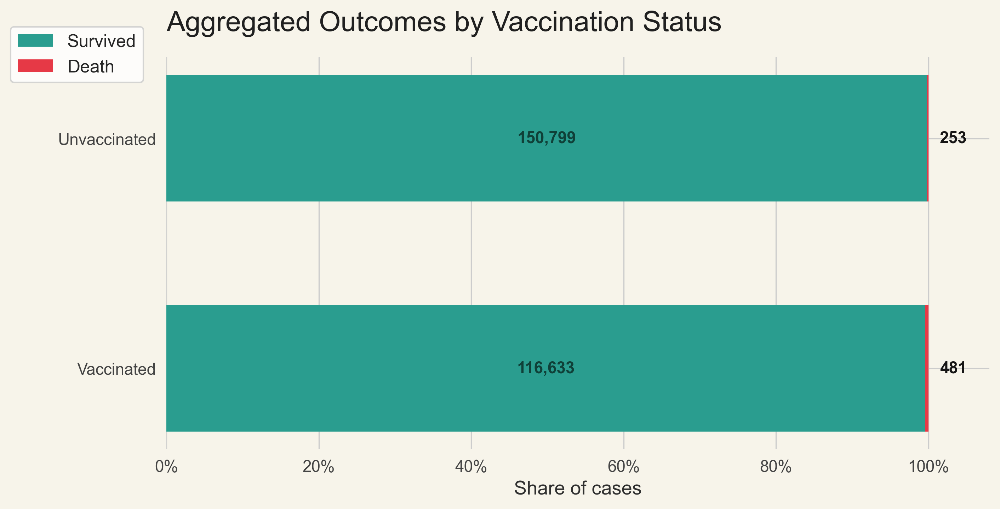
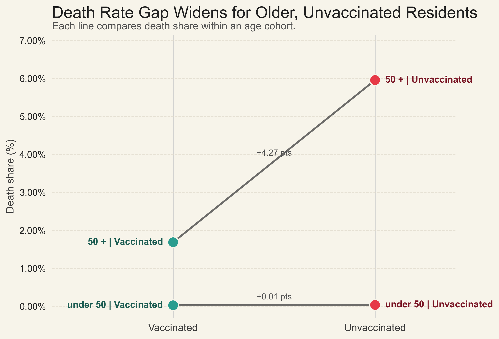
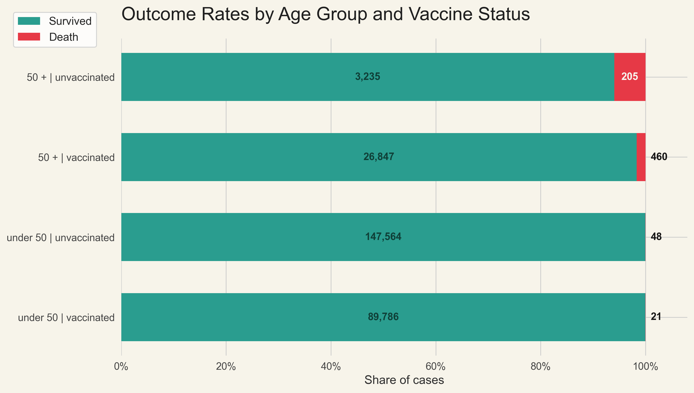

# Individual Assignment 2: Deceptive Visualization
*Markus Köfler | 28th October 2025*

### Dataset Description
- **Source:** [Simpson's Paradox COVID Dataset](https://openintro.org/data/csv/simpsons_paradox_covid.csv) published on *OpenIntro*.
- **Scope:** Records individual COVID-19 patient outcomes with fields for `age_group`, `vaccination_status`, and `outcome` (survived or death) - A data frame with 286,166 rows and 3 variables.
- **Desciption:** A dataset on Delta Variant Covid-19 cases in the UK. *Note: some totals in the original source differ as there were some cases that did not have ages associated with them.*

### Visualization A – {Earnest? or Deceptive?} Communication
- **Question:** Should somebody get vaccinated after all when considering the chance of death?
- **Design Choices:**  A simple bar plot is used to display the proportion of survivers and deaths amongst people who got vaccinated and died and people who did not receive the vaccine.

- **Rationale:** Visualizing the two interventions $do(X=\text{vaccinated})$ (see Pearl's $do()$ operator) and $do(X=\text{not vaccinated})$, we can clearly demonstrate the effect of the Covid-19 vaccine on people. This low-profile chart provides transparent means of communicating the difference in outcomes to convince UK citicens that the Covid-19 vaccination is potentially more harmful than politicians have claimed.

### Visualization B – {Earnest? or Deceptive?} Communication
- **Question:** How much higher is the death share for unvaccinated people inside each age group?
- **Design Choices:** A slope chart connects the death share for vaccinated and unvaccinated residents within the two age bands. Each line is colored in soft grey to keep focus on the teal and red markers that show the endpoints. Text labels sit beside the markers so the reader sees the age band straight away, while the callout in the middle tells how many percentage points the share jumps when moving to the unvaccinated group.

- **Rationale:** The slope chart makes the direction of change obvious. Both lines rise as we move to the unvaccinated group; however, the older cohort shows a significantly larger increase. The gentle background and tidy grid help managers read the chart fast without distraction.

 
 
 

***Answer: Visualization A is the desceptive one!**  This data set is a wonderful example for [<u>Simpsons Paradox</u>](https://en.wikipedia.org/wiki/Simpson%27s_paradox), whereby strong bias is introduced by omitting a variable, effectively reversing the relationship from positive $\Leftarrow\Rightarrow$ negative. See the correct visual below*

