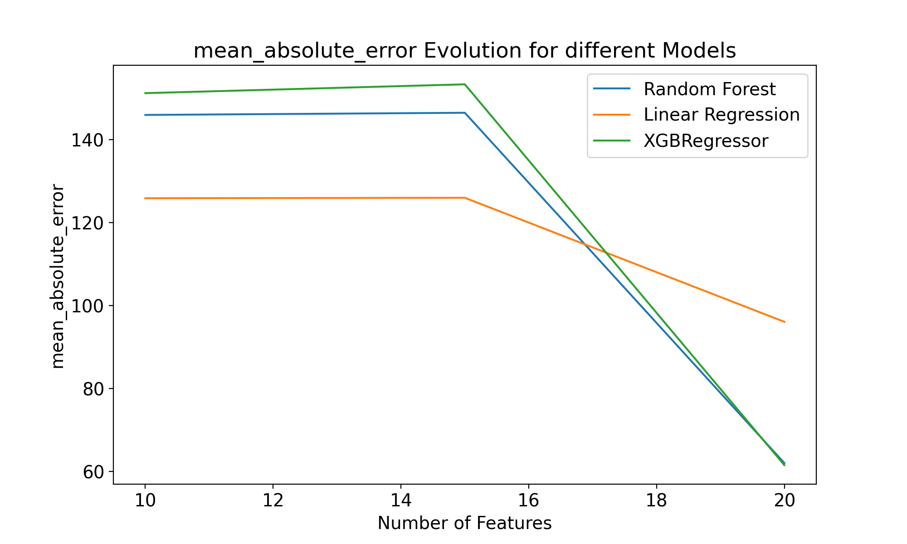
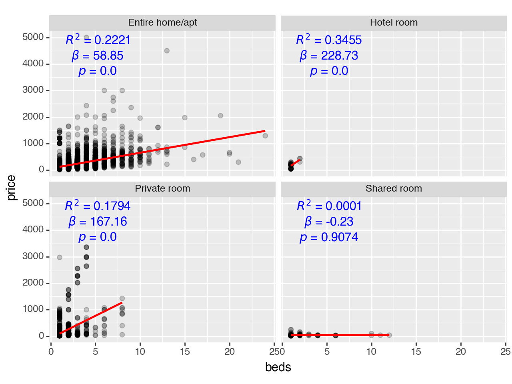
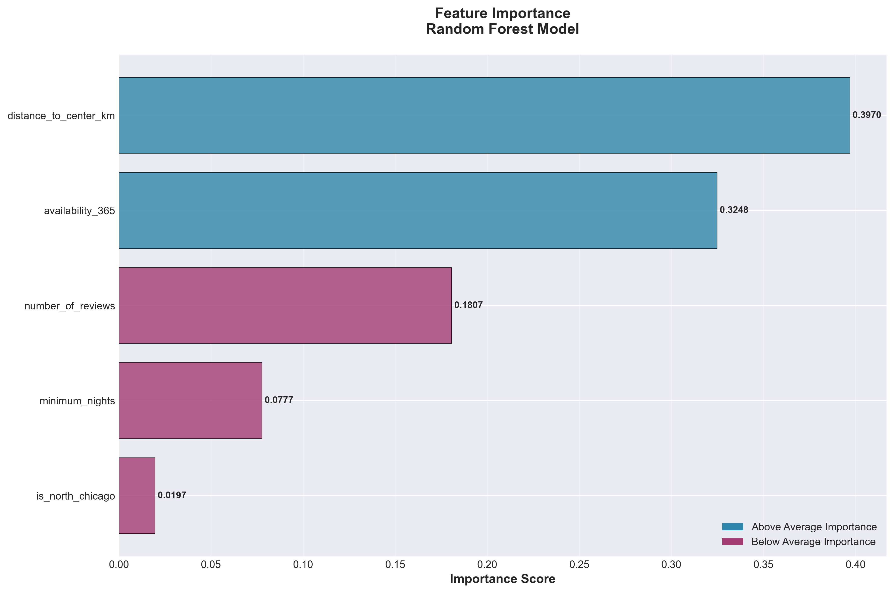
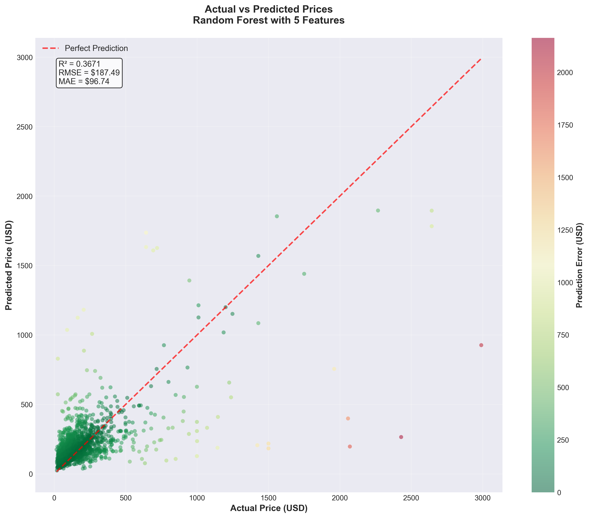

# Modelling:  Chicago Airbnb Visual Data Science Project
*Markus Köfler | 4th December 2025*

### Modeling Approach

To understand the factors that determine Airbnb prices, I trained & benchmarked 3 supervised statistical models on carefully & manually prepared features that I crafted based on intuition - I simply asked: *what could influence the target variable* `price`? The Random Forest model proved to be the most effective predictor. A key finding was that model performance consistently improved as I included more features, increasing from 10 to 20 predictors. This suggests that Airbnb pricing is complex and influenced by a wide array of factors. 

#### Pre-Modeling Stage: 
Before diving into the regression task, I wanted to explore the data structure without any preconceived notions. I applied **K-Means clustering** to segment the listings based on numerical features like `beds`, `bedrooms`, and `accommodates`. This unsupervised approach revealed distinct market segments, such as small, high-availability properties versus larger, family-oriented rentals. Additionally, I used association rule learning to uncover patterns in amenity offerings, identifying which amenities frequently co-occur. This insight helped inform feature selection for the subsequent regression models. Lastly, I concucted regression analysis to assess linear relationships among features and the target variable `price`, which provided a foundational understanding of key drivers. An example is provided below, visualizing the 3-dimensional regression task between `room_type`, `accommodates` (number of beds in a room) and `price`:

  

    
  

  

    
  

Here, the outcome would match with our intuition, that the more beds in a room, the higher the price. However, this is not the case for shared rooms, where the number of beds may even slightly decrease the price.

### Increase Trust through Visualization

To enhance the model's credibility and facilitate stakeholder understanding, I employed various visualization techniques. These visualizations served multiple purposes:

1. **Model Performance Visualization**: I created plots to illustrate the model's performance metrics, such as $MAE$, $RMSE$, $MSE$, and $R^2$ values, across different feature sets. This helped stakeholders (customers, colleagues...) grasp the impact of feature selection on model accuracy.

2. **Feature Importance Visualization**: By visualizing feature importance scores from the Random Forest model, I emphasized the most influential factors driving Airbnb prices. This transparency fosters trust in the model's predictions and aids in identifying potential areas for further investigation, for example, if feature importance aligns with domain knowledge.

3. **Prediction Distribution Visualization**: I plotted the distribution of predicted prices against actual prices to identify any systematic biases in the model. This visualization revealed areas where the model performed well and where it struggled, guiding future improvements.

4. **Geospatial Visualization**: Leveraging the geographic context of the data, I created maps to visualize predicted Airbnb prices across different neighborhoods. This spatial representation not only enhances interpretability but also allows stakeholders to see how local factors influence pricing or whether there are specific regions where the model's predictions deviate significantly from actual prices.

By employing these visualization strategies, I aimed to build trust in the model's predictions and facilitate informed decision-making among stakeholders.

Below are two examples:

  

    
  

  

    
  

