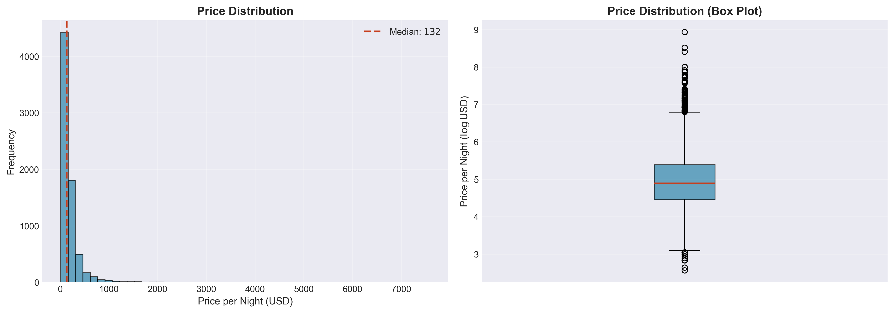
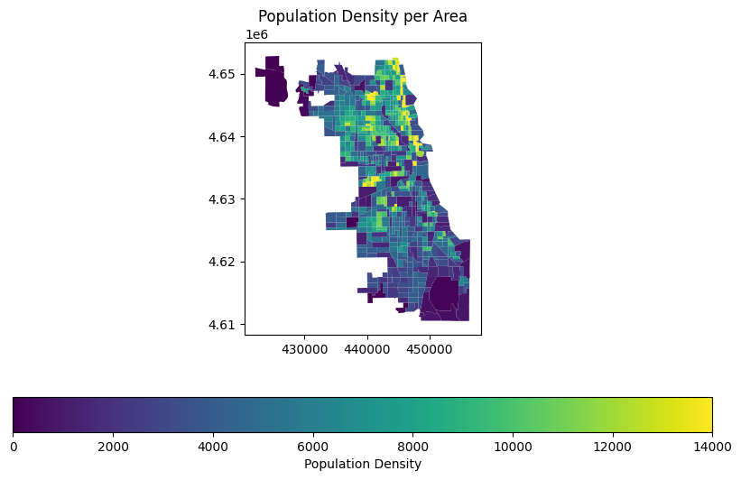
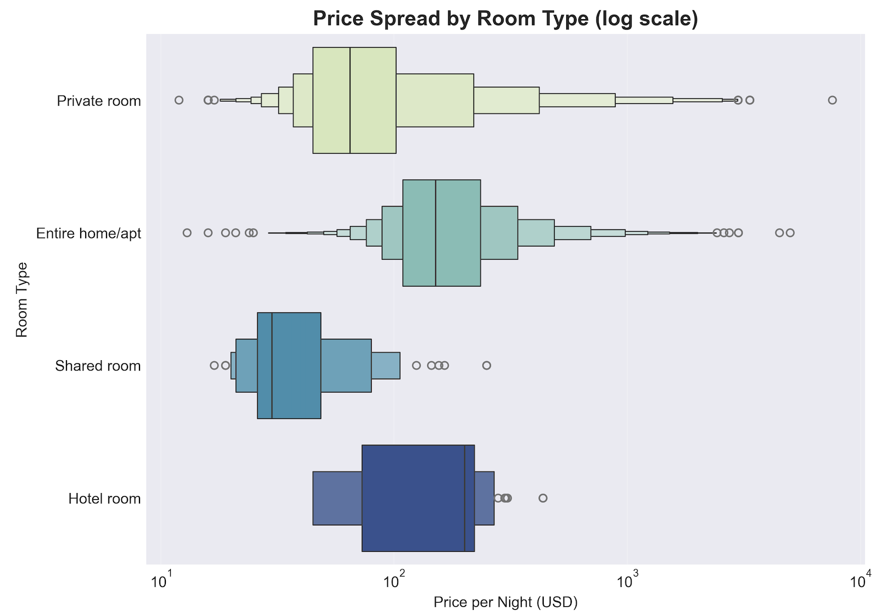
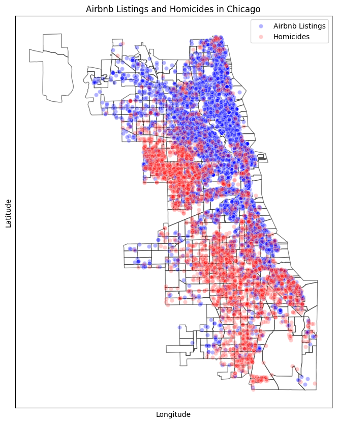
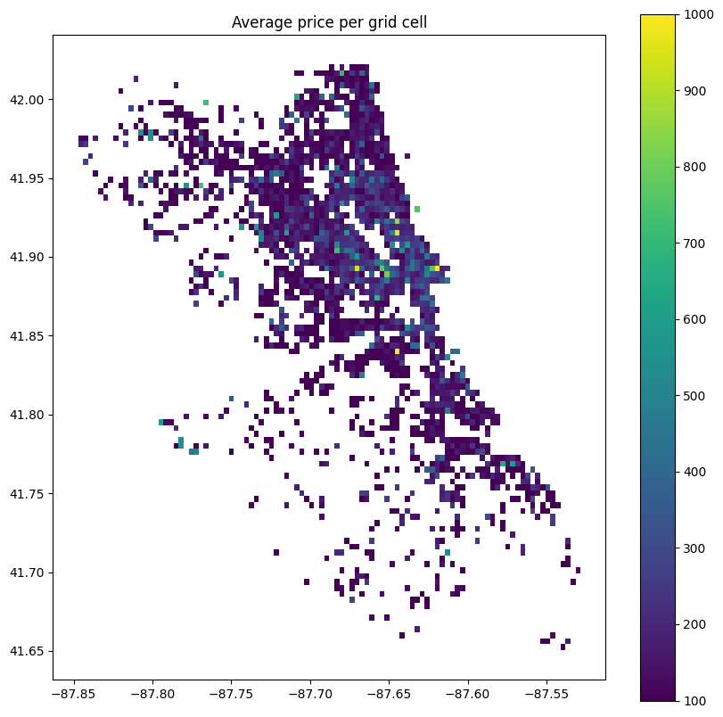

# Wrangle & Profile Report:  Chicago Airbnb Visual Data Science Project
*Markus Köfler | 26th October 2025*

## Wrangle Stage

### Joining of Datasets

To create a comprehensive dataset for analysis, I integrated three primary data sets: Airbnb listings, Chicago crime reports, and Chicago demographic/geographic data. The joining process was crucial for contextualizing the Airbnb and crime data within the city's landscape.

*   **Spatial Joins**: The primary method for merging the datasets was the spatial join, which combines data based on geographic location (derived from latitude, longitude) rather than a shared ID column. For instance, I joined Airbnb listings (points) to Chicago census tracts (polygons) to assign each listing to a specific neighborhood area. This allowed for aggregation of the data, such as counting the number of AirBnBs or crimes within each census tract. All geographic data was first converted to a common projection (EPSG:26916) to ensure accurate spatial relationships.

*   **Attribute Joins**: Standard attribute joins were also used. For example, census population counts were merged with census tract boundary data. This required creating a new key, `GEOID10_Subset`, from the `CENSUS BLOCK FULL` column to match the `GEOID10` key in the geographic boundary file, enabling a successful merge.

*   **Buffer and Join for Proximity Analysis**: To analyze the immediate surroundings of an Airbnb, I created a 2km circular buffer around each listing. I then performed a spatial join between these buffers and the crime data to count the number of homicides that occurred within that radius for each Airbnb.

### Data Cleaning & Preprocessing

The raw datasets required several cleaning and preprocessing steps to ensure they were accurate and ready for analysis.

*   **Data Type Conversion**: Several columns were in incorrect formats. The `price` column in the Airbnb data was a string containing "$" and "," characters, which I removed before converting it to a numeric float type. Similarly, the `Date` column in the crime dataset was converted from a string to a proper datetime format to enable time-based filtering.

*   **Handling Outliers**: I identified and removed significant outliers that would have skewed the analysis. This included an Airbnb listing with an erroneous price of nearly $10 million, which was filtered out. I also removed a small number of crime incidents that had latitude and longitude values falling far outside Chicago's geographic boundaries.

*   **Filtering for Relevance and Performance**: The initial crime dataset was massive, containing over 8 million records. To make the analysis manageable and focus on recent trends, I filtered the data to include only homicides reported since 2018.

*   **Complex Data Unpacking**: The `amenities` column was stored as a string that looked like a list (e.g., "['Wifi', 'Kitchen', ...]"). This required a multi-step process to unpack: the string was parsed, split into individual amenities, and then transformed into a one-hot encoded format where each amenity became its own column with a 1 or 0 value. This made it possible to analyze the impact of specific amenities on price.

*   **Managing Missing Values**: The datasets were relatively clean, with few missing values. For critical columns like `price`, rows with missing data were dropped. For others, such as `bedrooms` and `beds`, I filled missing values with a reasonable default of 1. When calculating crime counts per neighborhood, any area with no crimes was assigned a zero instead of a missing value.

### Visual Assessment of Data Quality

To get a holistic view of the integrated data and perform a visual sanity check, I overlaid the different geographic layers on a single map of Chicago. This visualization was a key step in the data quality assessment.

This map plots the boundaries of Chicago's census tracts (white polygons), the locations of all Airbnb listings (blue dots), and the locations of filtered homicide incidents (red dots).

**Quality Insights from the Visualization:**

1.  **Geographic Coherence**: The plot immediately confirms that the vast majority of the residence life in the northern districts of the city. This served as a quick sanity check that the spatial joins were performed correctly, as the Airbnb listings and crime incidents align well with known urban patterns in Chicago.

2.  **Pricing Distribution Plausibility**: The pricing of rooms per room type appears reasonable, with most listings clustered in the lower price ranges and a gradual decrease in frequency as prices increase. This distribution aligns with expectations for an urban Airbnb market, where budget options are more common than luxury listings - however, a couple of outliers are still present, which means that more detailled analysis on other relevant attributes is necessary.

    

## Profile Stage

### Insight 1: A Tale of Two Cities: The Geographic Divide of AirBnBs and Crime

The exploratory analysis revealed a noticeable geographic separation between the concentration of Airbnb listings and the prevalence of serious crime (homicide in this case). AirBnBs are clustered in the northern half of the city, particularly along the lakefront and in the downtown area. In contrast, the filtered homicide data shows a much higher density in the southern and western parts of Chicago. This spatial disparity is a fundamental characteristic of the city's Airbnb market. While high Airbnb density can lead to increased competition among hosts, the analysis later showed that crime density is a significant predictor of Airbnb prices, highlighting how safety perceptions can influence the market.

*Visualization showing the distinct geographic distributions of Airbnb listings and crime incidents.*

### Insight 2: Mapping the Price Landscape of Chicago AirBnBs

Airbnb prices vary significantly across Chicago. By dividing the city into a grid and calculating the average price of listings within each cell, I was able to create a price heatmap. This visualization clearly shows that the most expensive areas are concentrated in the central business district (The Loop) and extend northwards through affluent neighborhoods like Lincoln Park and Lake View. Prices generally decrease as one moves further south or west from the city center. This geographic pricing structure is a key insight for potential hosts and travelers, demonstrating that location is a primary driver of cost in the Chicago market.

Heatmap of Chicago showing that the highest average Airbnb prices are in the city center and northern neighborhoods.

